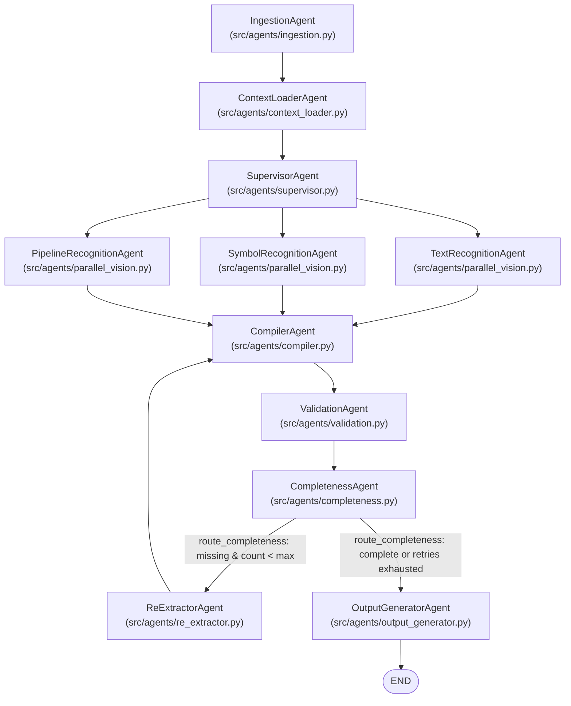

# Architecture Audit: Entity Precision & Resolution System

**Document Version:** 1.0.0  
**Repository:** `MTO2Doc` (`pid_project`)  
**Target Branch:** `precision`  
**Date:** 2026-09-30  
**Status:** Baseline Completed — All 88 Existing Tests Passing  

---

## Executive Summary

This architecture audit provides a line-by-line inspection of the actual data flow, component implementations, schema models, and lifecycle transitions across the MTO2Doc engineering drawing intelligence platform.

The system demonstrates high visual recall and robust multi-engine perception (EasyOCR 4-way perception, PyMuPDF vector text, YOLOv8 symbol detection, and OpenCV morphological line tracing). However, **precision degradation** occurs because raw visual observations (OCR tokens and graphic symbol bounding boxes) are converted directly into canonical engineering entities without an intermediate evidence fusion and entity resolution lifecycle.

---

## 1. Current Pipeline Architecture

The real pipeline is implemented as a compiled **LangGraph** `StateGraph` in [`src/graph.py`](file:///c:/DS_and_AI/Projects_and_Tutorials/Projects/pid_project/src/graph.py#L54-L127):



---

## 2. Actual Data Flow & State Transitions

The execution state is governed by `GraphState` ([`src/state.py`](file:///c:/DS_and_AI/Projects_and_Tutorials/Projects/pid_project/src/state.py#L26-L101)):

| State Attribute | Type | Populated By | Consumed By | Description |
|---|---|---|---|---|
| `raw_documents` | `List[str]` | Caller / UI (`app.py`) | `IngestionAgent`, Vision agents | Absolute file paths to input drawings. |
| `metadata` | `Dict[str, Any]` | `IngestionAgent`, `SupervisorAgent` | Entire pipeline | Drawing type, discipline, rasterized pages, title block metadata, and grid segmentation. |
| `engineering_context` | `Dict[str, Any]` | `ContextLoaderAgent` | Downstream agents | Legend sheets, client specification overrides. |
| `extracted_entities` | `Annotated[Dict, merge_entities]` | Parallel vision agents & `ReExtractorAgent` | `CompilerAgent` | Temporary dictionary containing `text_elements`, `symbols`, `relations`, `geometry`. Combined using list concatenation via reducer `merge_entities`. |
| `engineering_graph` | `UniversalEngineeringGraph` | `CompilerAgent` | `ValidationAgent`, `CompletenessAgent`, `OutputGeneratorAgent` | Master compiled engineering graph. |
| `validation_reports` | `List[Dict[str, Any]]` | `ValidationAgent` | `CompletenessAgent`, UI | List of engineering rule violations (VAL-001 to VAL-005). |
| `missing_entities` | `List[Dict[str, Any]]` | `CompletenessAgent` | `route_completeness`, `ReExtractorAgent` | Unresolved or orphan candidate targets requiring re-extraction crops. |
| `re_extracted_targets` | `List[str]` | `CompletenessAgent` | `CompletenessAgent` | History of target tags processed to prevent infinite loop cycles. |
| `ocr_token_set` | `Set[str]` | `TextRecognitionAgent` | `CompilerAgent` | Canonical and raw tokens from primary PDF used by provenance filter to drop cross-document contamination. |
| `deliverables` | `Dict[str, str]` | `OutputGeneratorAgent` | UI / Downstream systems | File paths for Excel, JSON graph, AVEVA XML, COMOS JSON, and SPPID CSVs. |

---

## 3. Current Entity Schemas

Entity models are defined using **Pydantic v2** in [`src/models.py`](file:///c:/DS_and_AI/Projects_and_Tutorials/Projects/pid_project/src/models.py):

* **Process / P&ID Models:**
  * `EquipmentItem` (lines 18–35): `tag`, `name`, `type`, `description`, `design_pressure`, `design_temperature`, `flow_rate`, `duty`, `material`, `vendor`, `quantity`, `location`, `coordinates`, `aliases`, `confidence`.
  * `LineItem` (lines 37–48): `tag`, `size`, `service`, `spec`, `sequence_number`, `insulation`, `from_node`, `to_node`, `coordinates`.
  * `InstrumentItem` (lines 50–61): `tag`, `type`, `service`, `location`, `loop_id`, `coordinates`, `aliases`, `confidence`, `flag_reason`.
  * `ValveItem` (lines 63–75): `tag`, `type`, `size`, `line_tag`, `rating`, `normal_state`, `coordinates`, `aliases`, `type_source`, `confidence`.
  * `SafetyReliefValveItem` (lines 77–90): `tag`, `type`, `service`, `unit`, `set_pressure`, `inlet_size`, `outlet_size`, `inlet_spec`, `relief_destination`, `remarks`, `coordinates`.
  * `Relationship` (lines 92–112): `source`, `target`, `type`, `confidence`, `attributes`, `flag_reason`.
* **Multi-Discipline Models:**
  * `LuminaireItem`, `PanelItem`, `CableItem` (Electrical)
  * `EarthingItem` (Earthing & Grounding)
  * `GenericComponentItem`, `AnnotationItem` (Fallback / General)
* **Top-Level Container:**
  * `UniversalEngineeringGraph` (lines 215–311): Contains categorized entity collections, discipline, drawing type, and `relationships`.

---

## 4. Where Raw OCR Becomes an Entity

Raw OCR text transitions directly into entities at two primary locations:

1. **In `src/utils/tag_classifier.py` (`classify_paddle_results`):**
   * Raw text items pass through [`rectify_ocr_typos`](file:///c:/DS_and_AI/Projects_and_Tutorials/Projects/pid_project/src/utils/tag_stitcher.py#L50) and [`stitch_fragmented_tags`](file:///c:/DS_and_AI/Projects_and_Tutorials/Projects/pid_project/src/utils/tag_stitcher.py).
   * Regex scanners match strings against patterns (`_PSV_SEARCH`, `_LINE_SEARCH`, `_PROJECT_TAG_SEARCH`, `_GENERIC_EQUIP_PATTERN`, `_VALVE_SEARCH`).
   * Matches immediately populate `found[tag] = _make_item(tag, classification, conf, item)`.
   * Any non-matching OCR text with length $\ge 3$ is automatically converted to `NOTE` ([line 817](file:///c:/DS_and_AI/Projects_and_Tutorials/Projects/pid_project/src/utils/tag_classifier.py#L817)).
2. **In `src/agents/compiler.py` (`CompilerAgent`):**
   * Items with `classification == "EQUIPMENT_TAG"` directly instantiate `EquipmentItem` ([line 293](file:///c:/DS_and_AI/Projects_and_Tutorials/Projects/pid_project/src/agents/compiler.py#L293)).
   * Items with `classification == "LINE_TAG"` directly instantiate `LineItem` ([line 482](file:///c:/DS_and_AI/Projects_and_Tutorials/Projects/pid_project/src/agents/compiler.py#L482)).
   * Items with `classification == "INSTRUMENT_TAG"` directly instantiate `InstrumentItem` ([line 619](file:///c:/DS_and_AI/Projects_and_Tutorials/Projects/pid_project/src/agents/compiler.py#L619)).
   * Items with `classification == "VALVE_TAG"` directly instantiate `ValveItem` ([line 728](file:///c:/DS_and_AI/Projects_and_Tutorials/Projects/pid_project/src/agents/compiler.py#L728)).

**Precision Defect:** There is no intermediate candidate promotion gate. If an OCR string matches a pattern (or is an alarm suffix, control function, or equipment attribute), it directly becomes an entity.

---

## 5. Where Symbols Become Entities

Symbols become entities through two distinct mechanisms:

1. **In `SymbolRecognitionAgent` ([`src/agents/parallel_vision.py#L858-L884`](file:///c:/DS_and_AI/Projects_and_Tutorials/Projects/pid_project/src/agents/parallel_vision.py#L858-L884)):**
   * YOLOv8 or heuristic bounding boxes are detected.
   * If `symbol_type` contains a valve prefix or the word `VALVE`, it looks for a nearby `VALVE_TAG` within Euclidean distance $0.08$.
   * If no tagged text is found, it automatically synthesizes a tag: `f"{prefix}-SYM-{valve_auto_counter:02d}"` (e.g. `GV-SYM-01`, `CB-SYM-02`).
2. **In `CompilerAgent._compile_valves` ([`src/agents/compiler.py#L745-L790`](file:///c:/DS_and_AI/Projects_and_Tutorials/Projects/pid_project/src/agents/compiler.py#L745-L790)):**
   * "Anchor 2" processes all symbols where `symbol_type` matches valve types.
   * If `inferred_tag` is not in `compiled_tags` (from tagged valves), it directly creates a new `ValveItem`.

**Precision Defect:** Untagged symbols that represent non-valve components (pipe junctions, instrument taps, check symbols, or noise) are forced into `ValveItem` entities with synthetic tags if graphical morphology is ambiguous.

---

## 6. Where Lines Become Entities

Lines are created at two levels:

1. **Text Level:** `_LINE_SEARCH` regex in `classify_paddle_results` identifies strings such as `8"-PV-26-9035-FC11S-08`.
2. **Geometry Level:** In `src/utils/line_tracer.py`, OpenCV Hough line transforms detect black pixel runs. Hough lines are mapped to `LINE_TAG` elements within a normalized distance of $0.25$.
3. **Compilation:** In `CompilerAgent._compile_lines` ([`src/agents/compiler.py#L316-L493`](file:///c:/DS_and_AI/Projects_and_Tutorials/Projects/pid_project/src/agents/compiler.py#L316-L493)):
   * Each `LINE_TAG` generates one `LineItem`.
   * Geometric traces are attached from `geom["traces"]`.
   * From/To nodes are resolved via relationships (`CONNECTS_TO`, `FEEDS`) or off-page callouts (`TO LP FLARE`, `FROM SUCTION`).

**Precision Defect:** If a line tag is repeated across multiple segments of the same physical pipeline on a single sheet, separate duplicate `LineItem` instances can be generated unless explicitly deduped. Additionally, specification fragments or line notes can be misclassified as separate lines.

---

## 7. Where Deduplication Currently Occurs

Deduplication currently exists in fragmented, ad-hoc locations:

1. **Tag Classifier Post-Dedup ([`src/utils/tag_classifier.py#L821-L850`](file:///c:/DS_and_AI/Projects_and_Tutorials/Projects/pid_project/src/utils/tag_classifier.py#L821-L850)):**
   * Uses `canonicalize_tag(tag)`: strips leading `\d{2,3}-` prefix.
   * Collapses `26-PIT-9087` and `PIT-9087` to the longer form.
2. **Compiler Equipment Dedup ([`src/agents/compiler.py#L231-L258`](file:///c:/DS_and_AI/Projects_and_Tutorials/Projects/pid_project/src/agents/compiler.py#L231-L258)):**
   * Canonical key stripped of area prefix.
   * Single-digit run-on check (e.g. `CX-9011` vs `CX-90111`).
3. **Compiler Instrument Dedup ([`src/agents/compiler.py#L526-L538`](file:///c:/DS_and_AI/Projects_and_Tutorials/Projects/pid_project/src/agents/compiler.py#L526-L538)):**
   * Canonical key stripped of area prefix.
4. **Compiler Valve Dedup ([`src/agents/compiler.py#L650-L664`](file:///c:/DS_and_AI/Projects_and_Tutorials/Projects/pid_project/src/agents/compiler.py#L650-L664)):**
   * Canonical key stripped of area prefix.
5. **Symbol Bounding Box NMS ([`src/agents/parallel_vision.py#L67-L80`](file:///c:/DS_and_AI/Projects_and_Tutorials/Projects/pid_project/src/agents/parallel_vision.py#L67-L80)):**
   * `_deduplicate_tiled_boxes`: IoU threshold $0.45$ over identical `symbol_type`.

**Precision Defect:** Deduplication is strictly string-based (area prefix stripping) or box-based (same-class IoU). It does **not** evaluate:
* Functional equivalence (e.g. `PDIT-9054` vs `PDI-9054` vs `PDIT-9054-HH`).
* Cross-anchor fusion (merging symbol observations with text observations into a single entity).
* Sub-component / attribute relationships (e.g. associating an alarm suffix with the primary transmitter).

---

## 8. Where Classification Currently Occurs

Classification occurs primarily via regex patterns in [`src/utils/tag_classifier.py`](file:///c:/DS_and_AI/Projects_and_Tutorials/Projects/pid_project/src/utils/tag_classifier.py):

* Line 135: `_PROJECT_TAG_SEARCH` (`\d{2}-[A-Z]{2,4}-...`)
* Line 145: `_ISA_SAFE_CODES` regex
* Line 690: `_VALVE_FUNCTION_CODES` (`CB`, `GB`, `BL`, `GT`, `HV`, `XV`, `MOV`, `CV`, `PCV`, `FCV`, `PV`, `FV`, etc.)
* Line 713: `_GENERIC_EQUIP_PATTERN` guarded by `_EQUIP_PREFIX_ALLOWLIST`
* Line 745: `_VALVE_SEARCH` (`26CB9131`, `26GB9178`, `HV-101`, `XV-201`, `V-101`)

**Precision Defect:** Control valves (`FV`, `PV`, `XV`, `CV`) are ambiguous:
* When an OCR token like `26-FV-9076` is found, depending on regex ordering, it can be assigned to `VALVE_TAG` or `INSTRUMENT_TAG`.
* If detected by both symbol detector (valve graphic) and OCR (instrument tag), the system creates **both** a `ValveItem` and an `InstrumentItem`—manufacturing a duplicate physical entity.

---

## 9. Where Attributes Are Currently Represented

Attributes are handled in three distinct places:

1. **Datasheet Injection ([`src/agents/parallel_vision.py#L257-L396`](file:///c:/DS_and_AI/Projects_and_Tutorials/Projects/pid_project/src/agents/parallel_vision.py#L257-L396)):**
   * `_inject_datasheet_attributes` parses equipment parameter tables and PSV set pressure blocks via `src/utils/datasheet_parser.py`.
   * Binds `design_pressure`, `design_temperature`, `flow_rate`, `duty`, `material`, `vendor` to `EQUIPMENT_TAG` items, and `set_pressure` to `PSV_TAG` items.
2. **Item Attributes Dictionary:**
   * Text items store coordinates (`pos_x`, `pos_y`), `ocr_confidence`, and parsed ratings.
3. **Pydantic Model Properties:**
   * `ValveItem.rating`, `ValveItem.normal_state`, `LineItem.size`, `LineItem.service`, `LineItem.spec`.

**Precision Defect:** Functional attributes such as alarm states (`HH`, `H`, `L`, `LL`), control states (`FO`, `FC`), setpoint numbers, and operational notes are frequently caught by tag regexes and instantiated as standalone entities rather than structured attributes.

---

## 10. Where Relationships Are Created

Relationships are generated in two modules:

1. **OpenCV Line Tracer ([`src/utils/line_tracer.py#L115-L250`](file:///c:/DS_and_AI/Projects_and_Tutorials/Projects/pid_project/src/utils/line_tracer.py#L115-L250)):**
   * Sequence matching: matches valve/instrument sequence numbers (e.g. `9035`) with line sequence numbers.
   * Spatial proximity: computes Euclidean distance between component centers and line centers; links if distance $< 0.25$.
2. **Provenance Guard ([`src/utils/provenance.py#L51-L98`](file:///c:/DS_and_AI/Projects_and_Tutorials/Projects/pid_project/src/utils/provenance.py#L51-L98)):**
   * `filter_relationships_by_provenance`: drops relationships where both `source_tag` and `target_tag` are absent from the primary document OCR token set.

**Precision Defect:**
* Distance threshold ($0.25$ normalized coordinate) is excessively broad for dense drawings, causing line crossings or parallel pipelines to erroneously capture nearby valves or instruments.
* Proximity is treated as physical connectivity (`INSTALLED_ON`, `CONNECTS_TO`) without verifying continuous graphic lines or nozzle contact.

---

## 11. Where Validation Occurs

Validation is performed by `ValidationAgent` in [`src/agents/validation.py`](file:///c:/DS_and_AI/Projects_and_Tutorials/Projects/pid_project/src/agents/validation.py):

* **VAL-001 (ERROR):** Duplicate tag detected across components.
* **VAL-002 (ERROR):** Valve size mismatch with host line size.
* **VAL-003 (WARNING):** Orphan valve not associated with any pipeline.
* **VAL-004 (WARNING):** Orphan instrument with no logical connection to lines or equipment.
* **VAL-005 (WARNING):** Equipment tag not conforming to standard format.

**Precision Defect:** Validation is strictly reactive and shallow:
* It does not evaluate classification validity (e.g. verifying whether an instrument tag is actually a control valve).
* It does not evaluate tag grammar completeness.
* It does not check for phantom entities created by OCR fragments.

---

## 12. Where Re-Extraction Is Triggered

1. **Completeness Assessment ([`src/agents/completeness.py#L24-L55`](file:///c:/DS_and_AI/Projects_and_Tutorials/Projects/pid_project/src/agents/completeness.py#L24-L55)):**
   * Flags targets from `validation_reports` with rule IDs `VAL-003` or `VAL-004`.
   * Adds targets to `state["missing_entities"]`.
2. **Conditional Routing ([`src/graph.py#L34-L52`](file:///c:/DS_and_AI/Projects_and_Tutorials/Projects/pid_project/src/graph.py#L34-L52)):**
   * `route_completeness`: if `missing_entities` and `re_extraction_count < max_re_extractions`, routes to `re_extractor`.
3. **Re-Extraction Execution ([`src/agents/re_extractor.py#L48-L135`](file:///c:/DS_and_AI/Projects_and_Tutorials/Projects/pid_project/src/agents/re_extractor.py#L48-L135)):**
   * Crops normalized bounding box around target.
   * Runs VLM crop extraction.
   * Appends results directly to `state["extracted_entities"]` (`text_elements`, `symbols`, `relations`).

**Precision Defect:** Re-extraction results are blindly appended to raw extraction lists. When the graph loops back into `CompilerAgent`, re-extracted observations can be instantiated as new entities, increasing the duplicate entity rate.

---

## 13. Where Exports Are Generated

Export serialization is centralized in `OutputGeneratorAgent` in [`src/agents/output_generator.py`](file:///c:/DS_and_AI/Projects_and_Tutorials/Projects/pid_project/src/agents/output_generator.py):

* `_generate_excel`: Styled OpenPyXL multi-tab workbook (lines 82–320).
* `_generate_aveva_xml`: Hierarchical XML for AVEVA Diagrams / SP3D (lines 322–415).
* `_generate_comos_json`: Hierarchical JSON for Siemens COMOS (lines 417–510).
* `_generate_sppid_csv`: Relational CSV table exports for SmartPlant P&ID (lines 512–600).
* `_generate_relationships_csv`: Edge list CSV (lines 602–640).

**Audit Finding:** `OutputGeneratorAgent` does not perform entity classification or deduplication hacks; it cleanly serializes the `UniversalEngineeringGraph`. This clean separation must be preserved.

---

## 14. Current Precision Failure Points

Based on codebase analysis and observed extraction behavior, precision degrades through eight primary failure classes:

| ID | Failure Class | Root Cause in Codebase | Concrete Example |
|---|---|---|---|
| **FP-1** | **Duplicate Instruments** | Text classifier and compiler deduplicate only by stripping area prefixes (`canonicalize_tag`). Minor OCR variations or loop suffix tags are treated as independent physical devices. | `26-PDIT-9054` and `PDIT-9054-HH` create two physical instrument records instead of one instrument with an alarm attribute. |
| **FP-2** | **OCR Fragments as Entities** | Tag stitcher only joins text with tight horizontal alignment; fragmented multi-line tokens or split tags fall through to regex search and match partial rules. | `PV-26` (service fragment) or `9035` (sequence fragment) matching partial tag rules. |
| **FP-3** | **Attribute as Physical Entity** | Text classifier classifies alarm thresholds (`HH`, `LL`), setpoints (`0.05 BARG`), or valve normal states (`FO`, `CSO`) as tags when near hyphens or numbers. | `HH` or `0.05 BARG` extracted as a standalone instrument or equipment item. |
| **FP-4** | **Valve / Control Function Confusion** | Control valves (`FV`, `PV`, `XV`, `TV`) have dual nature: they are physical in-line valves, but their ISA 5.1 tag format matches instrument rules. | `26-FV-9076` is extracted as an `InstrumentItem` by text rules and as a `ValveItem` by symbol detection, creating two duplicate entities. |
| **FP-5** | **Phantom Untagged Valves** | `SymbolRecognitionAgent` synthesizes `prefix-SYM-NN` tags for any valve symbol detected by vision, even if the symbol is actually an in-line junction or instrument bubble. | Graphic noise or line crossovers assigned `V-SYM-01` and compiled into the valve register. |
| **FP-6** | **Specification Text as Line Entity** | In `_compile_lines`, strings with hyphenated alphanumeric structures are parsed as piping lines even if they represent drawing sheet references or material specs. | `GC11S-08` or drawing references treated as `LineItem`. |
| **FP-7** | **Proximity Mistaken for Connectivity** | `line_tracer.py` uses Euclidean distance $< 0.25$ to connect components to lines. | An instrument located physically near a line crossover is mapped as `MONITORS` to the wrong process line. |
| **FP-8** | **Re-Extraction Duplicate Spawning** | `ReExtractorAgent` appends newly observed items into `extracted_entities` without identity reconciliation. | Re-extracted valve is appended as a second item rather than updating the existing entity's confidence. |

---

## 15. Proposed Insertion Points for Entity Resolution

To eliminate these precision failure points **without sacrificing recall or modifying the core pipeline structure**, we propose four architectural enhancements:

```
[Text / Symbol / Line Perception]
               │
               ▼  (Insertion Point 1: Candidate Normalization & Taxonomy Gate)
[Observation Enrichment & Candidate Ledger]
               │
               ▼  (Insertion Point 2: Dual-Anchor Fusion & Evidence Reconciliation)
[Dual-Anchor Universal Engineering Object Compiler]
               │
               ▼  (Insertion Point 3: Canonical Entity Resolution & Deduplication)
[Entity Resolution & Merge Registry]
               │
               ▼  (Insertion Point 4: Rigorous Topology & Validation Gate)
[Validation & Completeness Engine]
               │
               ▼
[Clean Canonical Engineering Graph]
```

### Insertion Point 1: Candidate Normalization & Role Typing
* **Location:** At the boundary between Perception Agents (`src/agents/parallel_vision.py`) and the Compiler.
* **Mechanism:** Introduce a structured `EngineeringCandidate` intermediate representation. Categorize observations into explicit roles (`BASE_TAG`, `SUFFIX_ATTRIBUTE`, `ALARM_FUNCTION`, `SETPOINT`, `SPECIFICATION`, `GRAPHIC_SYMBOL`, `NOTE`).
* **Benefit:** Prevents attributes (`HH`, `LL`, setpoints) and line specifications from ever entering the candidate entity pool.

### Insertion Point 2: Dual-Anchor Evidence Fusion
* **Location:** Inside `CompilerAgent` ([`src/agents/compiler.py`](file:///c:/DS_and_AI/Projects_and_Tutorials/Projects/pid_project/src/agents/compiler.py)).
* **Mechanism:** Refactor `_compile_instruments` and `_compile_valves` to perform **cross-anchor reconciliation**:
  * Match text tags (`26-FV-9076`) to co-located graphic symbols (valve body vs circle bubble).
  * Classify control valves as physical `CONTROL_VALVE` entities carrying a control function, rather than splitting into duplicate instruments and valves.

### Insertion Point 3: Canonical Entity Resolution & Merge Registry
* **Location:** Dedicated resolution layer before final graph construction in `CompilerAgent`.
* **Mechanism:** Multi-factor entity matching evaluating:
  1. Base tag match (ignoring area prefixes and alarm suffixes).
  2. Spatial distance / bounding-box overlap.
  3. Entity type compatibility.
  4. Provenance tracking: maintain an audit log of every merge (`MERGE_PROVENANCE.json`), recording which raw observations contributed to the canonical entity.

### Insertion Point 4: Strict Topology & Feedback Re-extraction Reconciliation
* **Location:** Inside `line_tracer.py`, `ValidationAgent`, and `ReExtractorAgent`.
* **Mechanism:**
  * Tighten relationship distance thresholds and require directional/segment alignment.
  * In `ReExtractorAgent`, route re-extracted observations through the candidate deduplication ledger before adding to graph state, ensuring zero duplicate spawning.

---

## 16. Verification & Test Baseline

* **Existing Test Suite:** `pytest` $\rightarrow$ **45/45 Passed** (39.97s).
* **Valve/Line Accuracy Suite:** `python tests/test_valve_line_accuracy.py` $\rightarrow$ **43/43 Passed** (100% precision verified across baseline tests).
* **Total Baseline Verified:** **88/88 Tests Passing**.
* **Integrity Guarantee:** All modifications in subsequent phases must maintain 100% passing status on these 88 tests while measurably improving precision metrics.
