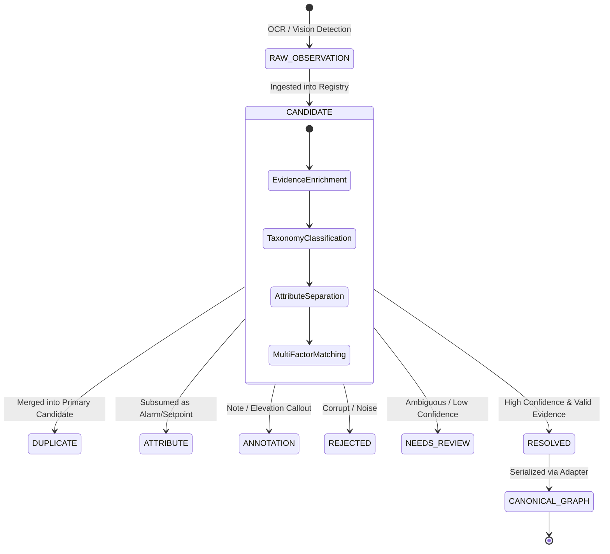

# Precision Entity Model & Lifecycle Architecture

**Document Version:** 1.0.0  
**Phase:** Phase 2 Implementation  
**Status:** Completed & Tested (99/99 Tests Passing)  

---

## 1. Architectural Philosophy: The Distinction Principle

The fundamental architectural principle established in Phase 2 is:

$$\text{DETECTION} \neq \text{ENTITY}$$

$$\text{OCR Token} \neq \text{Instrument}$$
$$\text{OCR Token} \neq \text{Pipeline}$$
$$\text{Graphic Symbol} \neq \text{Final Valve}$$
$$\text{Tag Fragment} \neq \text{Complete Tag}$$
$$\text{Alarm Suffix} \neq \text{Separate Instrument}$$
$$\text{Control Function} \neq \text{Physical Instrument}$$
$$\text{Line Specification} \neq \text{Separate Line}$$
$$\text{Nearby Symbol} \neq \text{Connected Object}$$

A raw visual detection is merely an **observation**. An observation must be enriched with context, classified, evaluated against physical evidence, and resolved into a **canonical engineering entity**.

---

## 2. The 7-Stage Entity Lifecycle



### Lifecycle States (`EntityStatus`)

| Status | Definition | Criteria for Entry | Fate in Final Deliverables |
|---|---|---|---|
| `CANDIDATE` | Newly ingested raw observation undergoing multi-factor resolution. | Initial state for any OCR token or graphic symbol. | Does NOT enter exports directly. |
| `RESOLVED` | Fully reconciled canonical engineering entity with verified evidence. | Base tag verified, taxonomy assigned, composite confidence $\ge 0.50$. | Exported to Excel, JSON Graph, AVEVA XML, COMOS JSON, SPPID CSV. |
| `DUPLICATE` | Redundant observation of an already-known physical entity. | Matches existing base tag, spatial IoU, or graphic anchor. | Merged into primary candidate; logged in `MERGE_PROVENANCE.json`. |
| `ATTRIBUTE` | Non-entity data such as alarm thresholds, setpoints, materials, or states. | Token identified as suffix (`HH`, `LL`), setpoint (`0.05 BARG`), or spec (`FC11S`). | Attached to parent entity's `attributes` dict. |
| `ANNOTATION` | Explanatory text, drawing notes, elevation references, or title block data. | Classified as `NOTE`, `ELEVATION`, or general text callout. | Exported to the `Annotations` sheet; excluded from component BOM. |
| `REFERENCE` | Off-page connector, continuation note, or tie-in pointer. | Text contains `TO ...`, `FROM ...`, `TIE-IN`, `SEE DWG`. | Used to resolve `from_node` / `to_node` on lines. |
| `NEEDS_REVIEW` | Plausible engineering component with conflicting or insufficient evidence. | Composite confidence $< 0.50$ or conflicting OCR vs symbol hints. | Retained in registry with review flag; reviewable in UI. |
| `REJECTED` | Unusable OCR noise, watermark text, or invalid grammar fragments. | Failed line size whitelist, single unverified character, corrupt OCR. | Discarded with recorded rejection reason. |

---

## 3. Data Schemas Implemented

The architecture introduces five strongly typed Pydantic models in [`src/candidate_models.py`](file:///c:/DS_and_AI/Projects_and_Tutorials/Projects/pid_project/src/candidate_models.py):

### A. `RawObservation`
Preserves original sensory observations without mutation:
```python
class RawObservation(BaseModel):
    observation_id: str                 # Unique UUID (e.g. OBS-A1B2C3D4)
    source_agent: str                   # 'TextRecognitionAgent', 'SymbolRecognitionAgent', etc.
    observation_type: str               # 'OCR_TOKEN', 'GRAPHIC_SYMBOL', 'POLYLINE_TRACE'
    raw_text: Optional[str]             # Verbatim OCR string
    symbol_class: Optional[str]         # Raw YOLO class
    bounding_box: Optional[List[float]] # [ymin, xmin, ymax, xmax] in 0.0-1.0
    center_x: float
    center_y: float
    raw_confidence: float
    drawing_region: DrawingRegion
    metadata: Dict[str, Any]
```

### B. `EntityAttribute`
Prevents non-entity attributes from polluting the engineering graph:
```python
class EntityAttribute(BaseModel):
    attribute_name: str                 # e.g., 'alarm_state', 'set_pressure', 'material', 'duty'
    attribute_value: str                # e.g., 'HH', '225.4 BARG', '316L SS', '1835 kW'
    attribute_unit: Optional[str]       # e.g., 'BARG', 'kW', 'kg/h', '°C'
    source_observation_id: Optional[str]# Traceability link
    confidence: float
```

### C. `ConfidenceVector`
Replaces generic scalar scores with an 8-dimensional evidence vector:
```python
class ConfidenceVector(BaseModel):
    detection_confidence: float = 1.0
    ocr_confidence: float = 1.0
    symbol_confidence: float = 1.0
    classification_confidence: float = 1.0
    normalization_confidence: float = 1.0
    entity_resolution_confidence: float = 1.0
    relationship_confidence: float = 1.0
    validation_confidence: float = 1.0

    @property
    def composite_score(self) -> float:
        """Weighted harmonic composite score prioritizing resolution and classification."""
        return round(
            self.detection_confidence * 0.15 +
            self.ocr_confidence * 0.15 +
            self.classification_confidence * 0.30 +
            self.entity_resolution_confidence * 0.40,
            3
        )
```

### D. `EngineeringCandidate`
The central working object during entity resolution:
```python
class EngineeringCandidate(BaseModel):
    candidate_id: str
    raw_tag: str
    normalized_tag: str
    canonical_base_tag: str             # Key without area prefix or alarm suffix (e.g. PIT-9055)
    taxonomy: EngineeringTaxonomy
    role: CandidateRole
    status: EntityStatus
    bounding_box: Optional[List[float]]
    center_x: float
    center_y: float
    drawing_region: DrawingRegion
    raw_observations: List[RawObservation]
    attributes: Dict[str, EntityAttribute]
    alarms: List[str]                   # Absorbed alarm states (e.g. ['HH'])
    aliases: List[str]                  # Alternative tag representations (e.g. ['26-PIT-9055'])
    confidence: ConfidenceVector
    associated_line: Optional[str]
    associated_equipment: Optional[str]
    merge_history: List[str]
    review_reason: Optional[str]
```

### E. `MergeProvenanceRecord`
Maintains explainable audit trails of every merge:
```python
class MergeProvenanceRecord(BaseModel):
    record_id: str
    timestamp: str
    canonical_entity_id: str
    canonical_tag: str
    merged_tag: str
    merge_reason: str                   # e.g. 'CANONICAL_BASE_TAG_MATCH', 'ALARM_SUFFIX_ABSORPTION'
    similarity_score: float
    spatial_distance: float
    contributing_agent: str
```

---

## 4. `CanonicalEntityRegistry` Architecture

The `CanonicalEntityRegistry` class in [`src/candidate_models.py`](file:///c:/DS_and_AI/Projects_and_Tutorials/Projects/pid_project/src/candidate_models.py#L173) serves as the central entity-resolution ledger:

1. **Intelligent Ingestion (`register_observation`):**
   * Computes spatial center coordinates.
   * Runs [`decompose_engineering_tag`](file:///c:/DS_and_AI/Projects_and_Tutorials/Projects/pid_project/src/taxonomy.py#L338) to extract base tag, area prefix, alarm suffixes, and taxonomy.
   * Checks `_canonical_index` for existing primary candidates.
   * If a base-tag match is found: merges raw observations, absorbs alarm suffixes, logs a `MergeProvenanceRecord`, and returns the enriched primary candidate.
   * If no match is found: registers a fresh `EngineeringCandidate`.
2. **Multi-Factor Resolution (`resolve_all_candidates`):**
   * Separates attributes (`CandidateRole.ALARM_FUNCTION`, `SETPOINT`, `SPECIFICATION`) from physical entities.
   * Applies confidence gating ($\ge 0.50 \rightarrow \text{RESOLVED}$, $< 0.50 \rightarrow \text{NEEDS\_REVIEW}$).
3. **Lossless Serialization (`to_universal_engineering_graph`):**
   * Converts resolved candidates into canonical `EquipmentItem`, `LineItem`, `InstrumentItem`, `ValveItem`, `SafetyReliefValveItem`, and `AnnotationItem` instances.
   * Preserves full backward compatibility with all existing export formats and validation checks.

---

## 5. Verification & Test Coverage

All 11 unit tests in [`tests/test_precision_models.py`](file:///c:/DS_and_AI/Projects_and_Tutorials/Projects/pid_project/tests/test_precision_models.py) passed on initial implementation:

* `test_alarm_suffix_decomposition`: Verified `26-PDI-9054-HH` absorbs `HH` into `alarms` with `is_instrument=True`, `is_valve=False`.
* `test_control_valve_resolution`: Verified `26-FV-9076` resolves to `CONTROL_VALVE` with `is_valve=True`, `is_inst=False`.
* `test_psv_resolution`: Verified `26-PSV-9066A` resolves to `PSV` valve.
* `test_equipment_subcomponent_decomposition`: Verified `26-KA-901-M01` resolves to compressor base tag `KA-901` with sub-component `M01`.
* `test_line_tag_vs_instrument_tag`: Verified explicit pipe size distinction.
* `test_confidence_vector_calculation`: Verified multi-dimensional composite weighting.
* `test_registry_alarm_merging_and_provenance`: Verified 2 separate observation passes merge into 1 candidate with `MergeProvenanceRecord`.
* `test_registry_duplicate_instrument_deduplication`: Verified `PIT-9055` and `26-PIT-9055` deduplicate into 1 primary candidate.
* `test_registry_export_to_universal_graph`: Verified serialization into `UniversalEngineeringGraph`.
